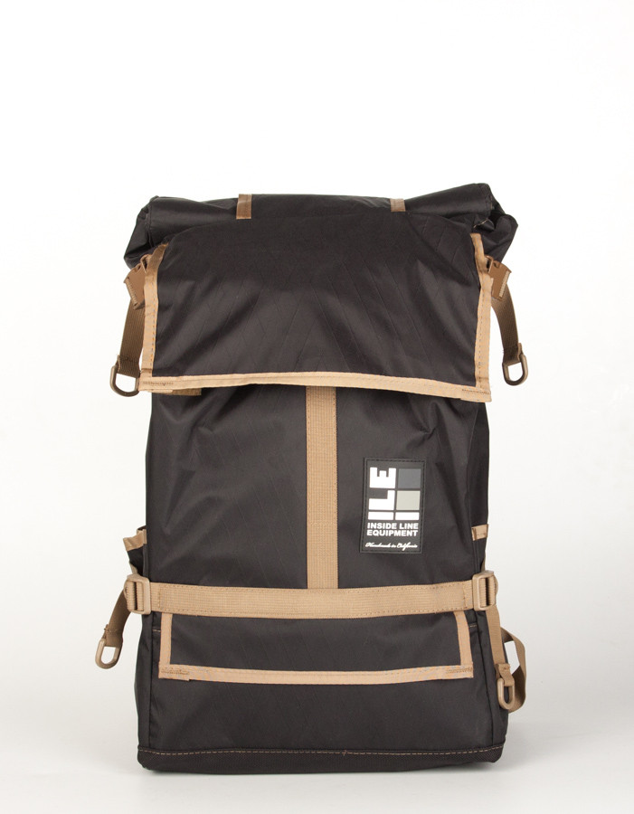

I've gone through several backpacks. Each time, sometime was lacking. Either there weren't enough pockets or the bag was so wide I bumped into people with the sides, or I simply couldn't fit all of my things in it for a whole day away from my apartment in a comfortable manner.

After a while, I made a list of things I needed:

- waterproof to protect my sensitive and precious electronics
- narrower than my shoulders
- large enough to hold a laptop, cables, jacket, and climbing gym gear
- quick access pockets
- option to cinch down to keep it from flopping around when not full
- made in the USA

The waterproof requirement let me immediately to cycling bags and ran into the [Inside Line Equipment Default Backpack][2].

[1]: http://ilequipment.com
[2]: http://ilequipment.com/collections/all/products/default-backpack?variant=4193254021
